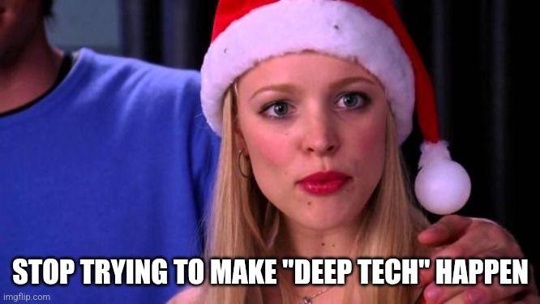

<meta name="twitter:card" content="summary_large_image" />
<meta name="twitter:site" content="@humbavc" />
<meta name="twitter:image" content="https://humbaventures.com/twitter_card.png" />

We're excited to announce our pivot from deep tech to shallow tech! We've been [beating](https://www.codingvc.com/p/betting-on-deep-tech){:target="_blank" rel="noopener"} the [drum](https://www.codingvc.com/p/the-golden-age-of-deep-tech){:target="_blank" rel="noopener"} for deep tech for the last few years, and tbh we're tired. It takes a lot of work to build [nuclear microreactors](https://antaresindustries.com/){:target="_blank" rel="noopener"} or [organoids that accelerate drug testing](https://www.parallel.bio/){:target="_blank" rel="noopener"} or [multistory warehouse robotics solutions](https://mytra.ai/){:target="_blank" rel="noopener"}, and why should we invest in those areas when we can back products launched with prompts shorter than this paragraph?

It's clear to us that the market has spoken:

So, we're excited to announce Humba's new AI^2 initiative!

We are **A**ll-**I**n on **AI**!

To make this more concrete, here's our new investing critera:
1. **Is your company less than 3 weeks old but wildly profitable?** (If you're not wildly profitable, maybe venture capital funding is not for you.)
2. **Have at least 10 competitors launch this week to "validate the space"?** (If not, maybe what you're building is just too hard and you should consider pivoting to a different ChatGPT prompt.)
3. **Can you vibe code, ~~test,~~ and launch at least 3 major features during our pitch meeting?** (If not, how will you move faster than your competition from the previous bullet point?)
4. **Is at least 100% of your code written by Cursor or Claude?** (We are extremely bullish on companies without any engineers on the team. The less technical skill required, the better.)

Other VCs invest in priced rounds or on notes with a discount to the next round, but we think those models are antiquated. That's why we only invest on notes with a _premium_ to the next round. AGI is going to lead to explosive growth, and our entry prices should relfect that.

If your fit our new criteria and find our investment offer attractive, please have your AI agent reach out to our AI agent. They'll know what that means.
