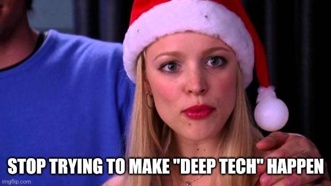

<meta name="twitter:card" content="summary_large_image" />
<meta name="twitter:site" content="@humbavc" />
<meta name="twitter:image" content="https://humbaventures.com/twitter_card.png" />

We've been investing in deep tech for a few years, but it's too hard and tbh we're tired. It's clear to us that the market has spoken:

It's clear to us that AI-generated companies are the future, and so we're going all in and renaming our fund to Slop Ventures. (Our motto: "we'll put as much time and effort into your company as you do!")

Here's our new investing criteria:
1. **Is your company less than 3 weeks old but wildly profitable?** (If you're not wildly profitable, maybe venture capital funding is not for you.)
2. **Have at least 10 competitors launch this week to "validate the space"?** (If not, maybe what you're building is just too hard and you should consider pivoting to a different ChatGPT prompt.)
3. **Can you vibe code, ~~test,~~ and launch at least 3 major features during our pitch meeting?** (If not, how will you move faster than your competition from the previous bullet point?)
4. **Is _at least_ 100% of your code written by Cursor or Claude?** (We are extremely bullish on companies without any engineers on the team. The less technical skill required, the better.)

Other VCs invest in priced rounds or on notes with a discount to the next round, but we think those models are antiquated. That's why we only invest on notes with a _premium_ to the next round. AGI is going to lead to explosive growth, and obviously our entry prices should reflect that.

If you fit our new criteria and find our investment offer attractive, please have your AI agent reach out to our AI agent. They'll know what that means.

Finally, if for some reason you're interested in reading about our historical investment areas, you can find them archived [here](https://humbaventures.com/).
