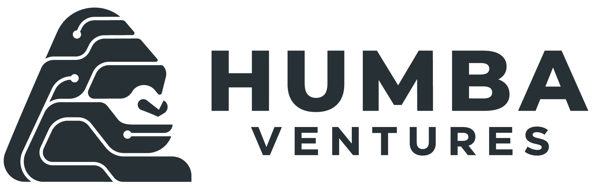

<meta name="twitter:card" content="summary_large_image" />
<meta name="twitter:site" content="@humbavc" />
<meta name="twitter:image" content="https://humbaventures.com/twitter_card.png" />

American Dynamism is a powerful movement championing startups that solve critical national problems in areas like defense, aerospace, manufacturing, and education. It supports builders strengthening U.S. national interests, reindustrialization, and infrastructure, often operating at the intersection of hardware and software.

However, like many movements, American Dynamism has its own lingo, which can take a while to master. This is the perfect place for a VC like us to add value to aspiring founders.

Presenting the [American Dynamism Pitch Writer](https://chatgpt.com/g/g-6822735f9fd4819198d6d07f9bb59ae3-american-dynamism-copy-editor){:target="_blank" rel="noopener"}! You input your idea, and we'll help you American Dynamismmaxx it.

A few examples:

"Gluten free chocolate chip cookies" =>

> Gluten-free chocolate chip cookies represent a strategic reconfiguration of the American dessert industrial base to operate in allergen-contested environments without sacrificing caloric superiority. By decoupling wheat dependencies and onshoring alternative flour inputs, this platform ensures resilient, inclusive treat production that can be forward-deployed across diverse dietary theaters while maintaining dominance in the baked-goods supply chain.

"A toothbrush for cats" =>

> A cat toothbrush isn’t just pet hygiene—it’s a frontline biosecurity instrument for maintaining domestic companion-animal readiness and preventing microbial degradation across the homefront. By deploying precision oral-care tooling into the feline segment, we’re reinforcing supply chain resilience in veterinary consumables while ensuring our household ecosystems remain hardened against bacterial adversaries in contested living environments. This is dual-use infrastructure for both pet wellness and national cleanliness dominance.

"A blockchain-based prediction markets app" =>

> A blockchain-based prediction markets app is a civilian-facing intelligence aggregation layer that hardens national decision-making by crowd-sourcing probabilistic forecasts in real time across contested information environments. By leveraging decentralized consensus as a resilience mechanism against adversarial manipulation, this platform transforms retail speculation into a forward-deployed strategic asset that strengthens situational awareness, capital efficiency, and ultimately American dominance in the global information battlespace.

"Neon colored washing machines" =>

> Neon-colored washing machines are a bold reindustrialization play to reassert American dominance in the domestic appliance battlespace by transforming mundane laundry units into high-visibility morale infrastructure. By integrating vibrant, signal-amplifying exteriors into core cleaning hardware, this platform enhances household readiness, strengthens manufacturing differentiation against foreign adversaries, and ensures our homefront operates with unmistakable operational flair in contested consumer environments.

Please check it out [here](https://chatgpt.com/g/g-6822735f9fd4819198d6d07f9bb59ae3-american-dynamism-copy-editor){:target="_blank" rel="noopener"} -- and don't forget to thank us when you raised your $50m friends and family round from a large multistage VC.

You can check out our past VC initiatives [here](https://humbaventures.com/af).
